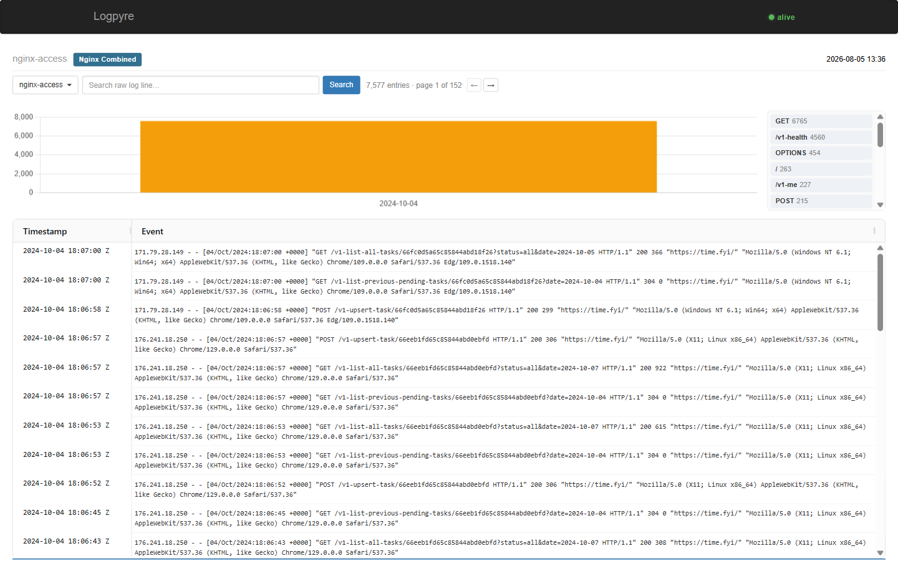

# Logpyre

[](https://github.com/dsalazarCazanhas/Logpyre/actions/workflows/ci.yml)
[](https://hub.docker.com/r/dsalazarcazanhas/logpyre)
[](LICENSE)

Lightweight log ingestion and search tool built on Flask and Elasticsearch.

Some UI ideas are borrowed from tools like Splunk, but the goal here isn't to
match their scope. Logpyre is built for fast **trace analysis**, with
**portability and ease of use** as the actual priorities — every feature is
scoped and hardened deliberately, without piling on noise.



## Stack

- **Python 3.10+**
- **Flask 3** — HTTP layer and server-side templates
- **Elasticsearch 9.3.2 (wolfi)** — indexing, storage, and search backend

## Quickstart

```bash
poetry install
cp example.env .env            # fill in your Elasticsearch credentials
poetry run flask --app src/logpyre/app.py run --debug --reload
```

Open `http://127.0.0.1:5000`, upload a log file, pick its format, search.

## Docker

`Dockerfile` is a multi-stage production build: dependencies resolve in a
builder stage, the runtime stage is a slim non-root image running Gunicorn
(`GUNICORN_WORKERS`, default: 2). Published to
[Docker Hub](https://hub.docker.com/r/dsalazarcazanhas/logpyre) on every
release.

```bash
docker run -p 5000:5000 --env-file .env dsalazarcazanhas/logpyre:latest
```

Building from a local checkout instead of the published image (e.g. while
developing a Dockerfile change):

```bash
docker build -t logpyre:dev .
docker run -p 5000:5000 --env-file .env logpyre:dev
```

### Docker Compose

`docker/compose.yml` is a quickstart stack: the published image alongside a
single-node Elasticsearch, both using the **same `.env`** described in
[Quickstart](#quickstart) — see `example.env` for the full variable list.
One value differs by context: `ELASTIC_HOST` should point at `127.0.0.1` when
you run Elasticsearch yourself, or at `elasticsearch` (the service name
below) when it's this compose stack doing it.

```bash
cp example.env .env      # once — edit credentials
docker compose --env-file .env -f docker/compose.yml up
```

For production, enable TLS verification: extract the Elasticsearch CA
fingerprint after the first start, then set `ELASTIC_CERT_FINGERPRINT` and
`APP_ENV=production` in `.env`.

```bash
docker cp elasticsearch:/usr/share/elasticsearch/config/certs/http_ca.crt .
openssl x509 -fingerprint -sha256 -noout -in http_ca.crt
# → SHA256 Fingerprint=AA:BB:CC:...
```

## Contributing

See [CONTRIBUTING.md](CONTRIBUTING.md) for development setup, how to add a new
parser, branch naming conventions, and the pre-PR checklist.

## License

Apache 2.0 — see [LICENSE](LICENSE).
